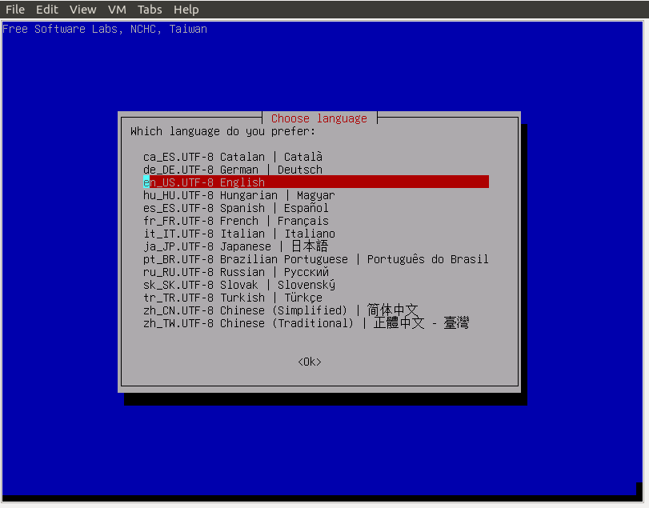
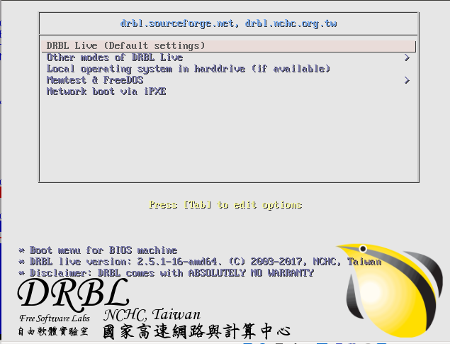
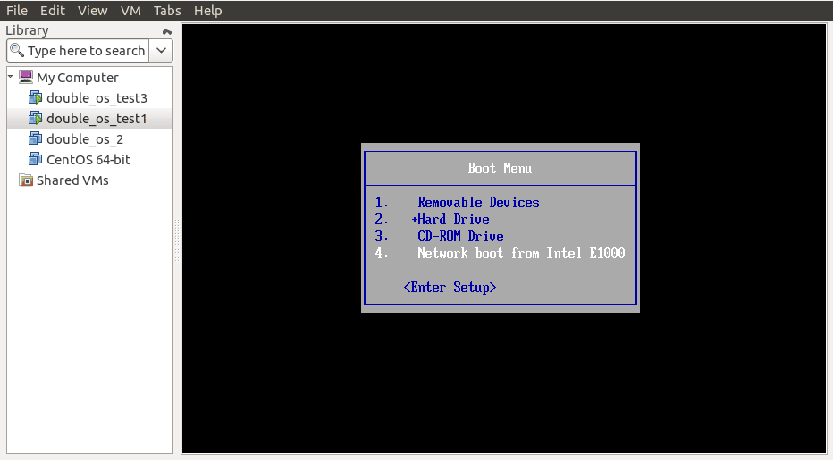

使用再生龙与企鹅龙
===================

一. 再生龙整盘备份
-------------------

下载再生龙
^^^^^^^^^^^^^^^^^

`【再生龙下载地址】 <http://clonezilla.nchc.org.tw/clonezilla-live/download/>`_

如何整盘备份
^^^^^^^^^^^^^^^

``再生龙LiveCD U盘启动``
"""""""""""""""""""""""""

.. image:: images/clonezilla_01.png
       :height: 643px
       :width: 484 px
       :scale: 110%
       :alt: alternate text
       :align: center

``备份过程``
""""""""""""""

通过ssh备份到服务器(192.168.5.166)目录/home/partimage/

二.企鹅龙批量部署
--------------------

下载企鹅龙
^^^^^^^^^^^^^^^

`【企鹅龙下载地址】 <http://drbl.nchc.org.tw/download/>`_

如何批量部署
^^^^^^^^^^^^^^^

``网络结构``
"""""""""""""

* DRBL Server 要有两个网口
    * 第一个，一个ip地址可以DHCP，获取地址
    * 第二个,手工配置ip地址

``企鹅龙LiveCD U盘启动``
"""""""""""""""""""""""""

.. image:: images/drbl_01.gif
       :scale: 100%
       :alt: alternate text
       :align: center

``挂载镜像``
""""""""""""""

准备一个U盘，将需要部署的镜像，拷贝到U盘中.
将存有部署镜像的U盘挂载到 `/home/partimage`.

.. image:: images/drbl_02.gif
       :scale: 100%
       :alt: alternate text
       :align: center

``配置Server``
"""""""""""""""

.. image:: images/drbl_03.gif
       :scale: 100%
       :alt: alternate text
       :align: center

.. image:: images/drbl_04.gif
       :scale: 100%
       :alt: alternate text
       :align: center

``终端Pxe启动``
""""""""""""""""

