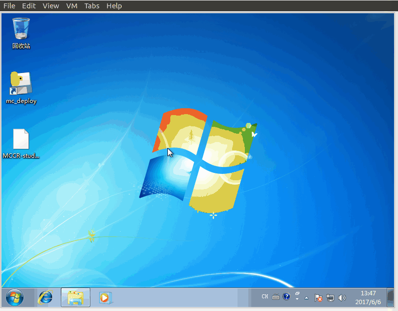
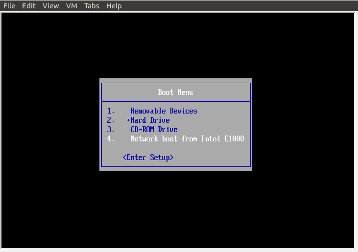

批量部署Windows端使用说明
==============================

1. 安装
-----------

.. image:: images/install _mc_deploy.gif
       :scale: 100%
       :alt: alternate text
       :align: center

2. 解压部署包
----------------

.. image:: images/unpack.gif  
       :scale: 100%
       :alt: alternate text
       :align: center

3. 关闭防火墙
--------------

4. 设置,并启动批量部署服务
---------------------------

.. image:: images/seting.gif  
       :scale: 100%
       :alt: alternate text
       :align: center

