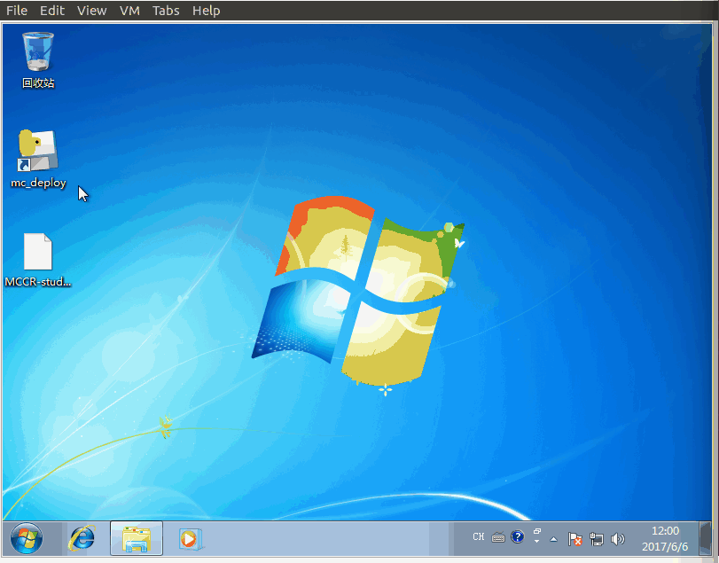
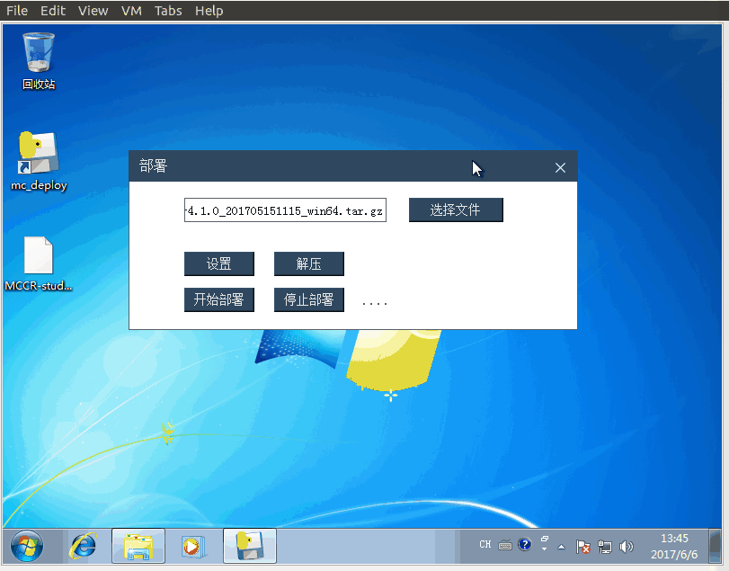

批量部署Windows端使用说明
==============================

1. 安装
-----------

Required:
    `Visual C++ 2015 x64 Redistributable Package <https://www.microsoft.com/zh-CN/download/details.aspx?id=48145>`_

    `Microsoft Visual C++ 2015 Redistributable Update 3 RC <https://www.microsoft.com/zh-cn/download/details.aspx?id=52685>`_
    

1.1 安装 Visual C++ 2015
^^^^^^^^^^^^^^^^^^^^^^^^^^^^^^

.. image:: images/install_vc2015.gif
       :scale: 100%
       :alt: alternate text
       :align: center

1.2 安装 mc-deploy
^^^^^^^^^^^^^^^^^^^^^^^^
.. image:: images/install _mc_deploy.gif
       :scale: 100%
       :alt: alternate text
       :align: center

2. 启动apache
---------------

.. image:: images/start_ser.gif  
       :scale: 100%
       :alt: alternate text
       :align: center

3. 解压部署包
----------------

4. 设置,并启动批量部署服务
---------------------------

  

