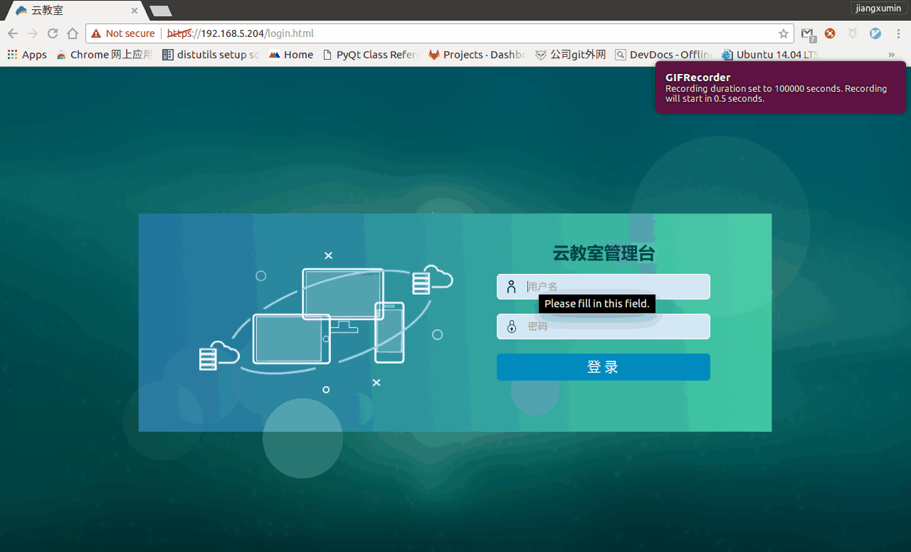

==================
课程模板制作与修改
==================

----------
1. 浏览器
----------

推荐使用 **Chrome** 浏览器,登录云教室管理台

.. image:: ../images/01_chrome_url.png
       :scale: 100%
       :alt: alternate text
       :align: center

--------
2. 登录
--------

1) 初始账户
----------------

* 用户名: **admin**   
* 密  码: **admin** 

2) 登录窗口
----------------
.. image:: ../images/login.png
       :scale: 100%
       :alt: alternate text
       :align: center

3) 第一次登录
----------------

高级选项
^^^^^^^^^^^^^^^^
若是第一次打开,选择 **高级**

.. image:: ../images/02_1.png
       :scale: 100%
       :alt: alternate text
       :align: center

继续前往
^^^^^^^^^^^^^^^^
点击 **继续前往...(不安全)**

.. image:: ../images/02_2.png
       :scale: 100%
       :alt: alternate text
       :align: center

-----------------------
3. 打开模板课程
-----------------------

选择课程标签
-------------

.. image:: ../images/04.png
       :scale: 100%
       :alt: alternate text
       :align: center

打开模板
-------------

.. image:: ../images/05.png
       :scale: 100%
       :alt: alternate text
       :align: center
.. image:: ../images/win_start_precess.png
       :scale: 60%
       :alt: alternate text
       :align: center

-----------------------
4. 修改模板(安装软件)
-----------------------
(略)

-------------------
5. 关闭虚拟机
-------------------

**模板课程修改完毕后,一定要关机**

.. image:: ../images/poweroff_01.png
       :scale: 100%
       :alt: alternate text
       :align: center
.. image:: ../images/poweroff_02.png
       :scale: 100%
       :alt: alternate text
       :align: center

-------------------
6. 虚拟机还原
-------------------

对单台终端，进行恢复。

* 第一步 : 登录云教室管理台，　点击：　资源－虚拟机　
* 第二步 : 选择所属教室，终端类型选择学生，点击搜索
* 第三步 : 找到，对应的终端编号。将虚拟机删除。
* 第四步 : 对应学生终端，点击图标，即可正常使用虚拟机。

