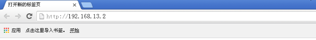
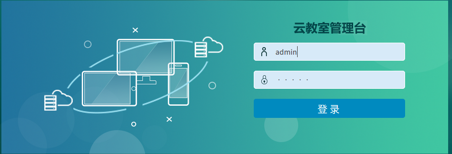
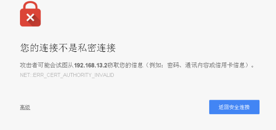
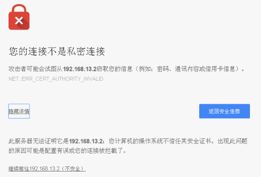
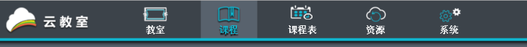
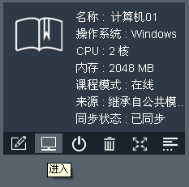
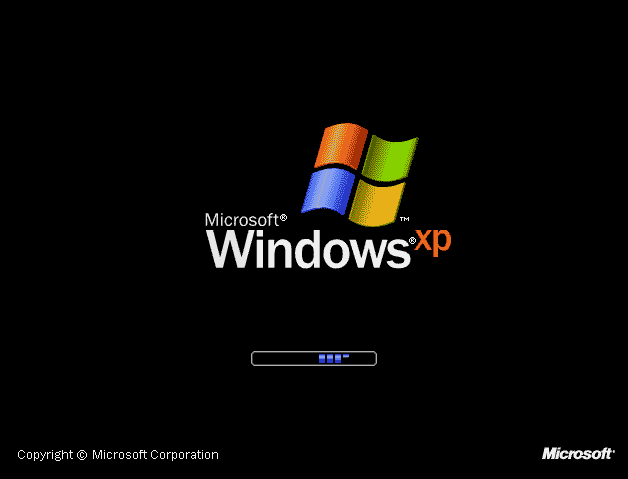
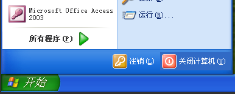
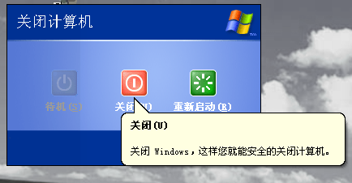

==================
课程模板制作与修改
==================

----------
1. 浏览器
----------

推荐使用 **Chrome** 浏览器,登录云教室管理台

--------
2. 登录
--------

1) 初始账户
----------------

* 用户名: **admin**   
* 密  码: **admin** 

2) 登录窗口
----------------

3) 第一次登录
----------------

高级选项
^^^^^^^^^^^^^^^^
若是第一次打开,选择 **高级**

继续前往
^^^^^^^^^^^^^^^^
点击 **继续前往...(不安全)**

-----------------------
3. 打开模板课程
-----------------------

选择课程标签
-------------

打开模板
-------------

-----------------------
4. 修改模板(安装软件)
-----------------------
(略)

-------------------
5. 关闭虚拟机
-------------------

**模板课程修改完毕后,一定要关机**

